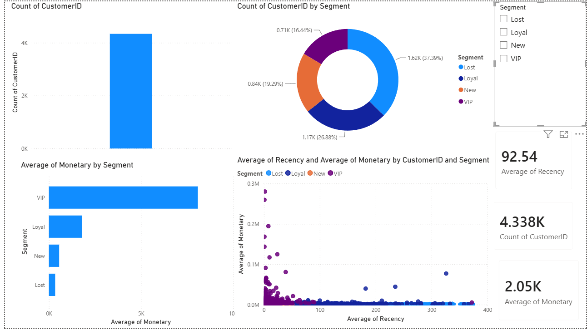

# Customer Segmentation — RFM Analysis

Segmenting e-commerce customers using **RFM analysis** (Recency, Frequency, Monetary) combined with **K-Means clustering** to identify actionable customer groups for targeted marketing.

## Dataset
- **Source:** E-commerce transactional dataset (Online Retail)
- **Records:** Customer purchase transactions (Invoice-level)

## Tech Stack
Python · pandas · scikit-learn · matplotlib · seaborn

## Workflow
1. **Data Cleaning** — removed nulls, duplicates, and invalid/cancelled transactions
2. **RFM Feature Engineering** — calculated Recency, Frequency, and Monetary value per customer
3. **Log Transform & Scaling** — handled skewness in RFM distributions before clustering
4. **Optimal K Selection** — used Elbow Method and Silhouette Score to choose number of clusters
5. **K-Means Clustering** — grouped customers into segments
6. **Segment Labeling** — assigned business-meaningful names (VIP, Loyal, New, Lost) based on cluster profiles
7. **3D Visualization** — visualized customer segments in RFM space

## Segments Identified
| Segment | Description |
|---------|-------------|
| VIP | High frequency, high spend, recent purchases |
| Loyal | Regular purchases, moderate spend |
| New | Recent first-time customers |
| Lost | No recent activity, low engagement |

## Business Value
This segmentation enables targeted marketing strategies — e.g., loyalty rewards for VIP customers, win-back campaigns for Lost customers, and onboarding flows for New customers.

## Files
| File | Description |
|------|-------------|
| `customer_segmentation_rfm_kmeans.ipynb` | Full analysis notebook |

##  Power BI Dashboard

### Dashboard Highlights
- **4,338** unique customers
- **4 segments**: VIP, Loyal, New, Lost
- Average Monetary: **$2,048**
- Average Recency: **92 days**

# Customer Segmentation - RFM Analysis & K-Means Clustering

## 📌 Overview
Customer segmentation project using RFM Analysis and K-Means Clustering
on real e-commerce data (541,909 transactions).

## 📊 Dashboard

## 🔧 Tech Stack
- Python, Pandas, Scikit-learn
- PyTorch (Autoencoder)
- Power BI

## 📈 Results
| Segment | Customers | Avg Monetary |
|---------|-----------|--------------|
| VIP     | 713       | $8,088       |
| Loyal   | 1,166     | $1,802       |
| New     | 837       | $557         |
| Lost    | 1,622     | $341         |
